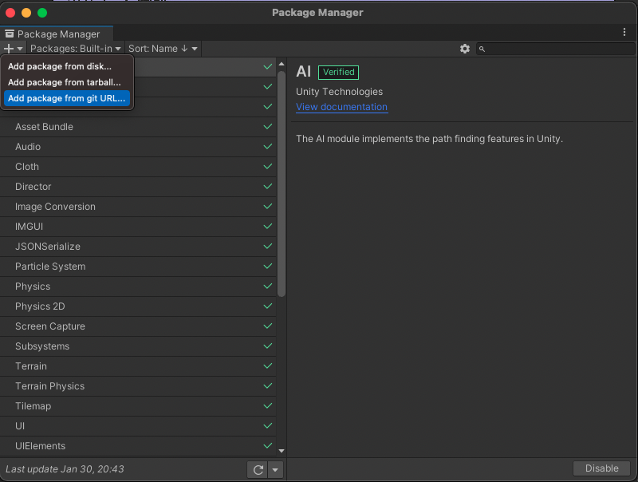
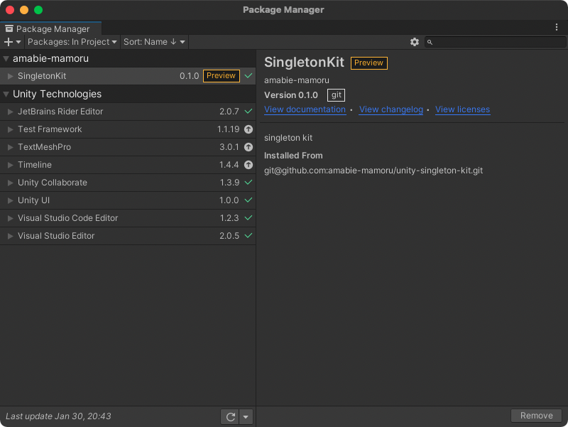

# singleton-kit

Singleton kit for unity

## Get started

First, [Window] -> [Package Manager] on Unity Editor menu bar.

Second, Click [+] button and select [Add package from git URL...]



And finally, copy following url and paste in package manager text box.

```
git@github.com:amabie-mamoru/singleton-kit.git
```



Let's enjoy 🧜🏼‍♂️

# Features

## Singleton

### Interface

#### Static Variables

Variable name | Description
--- | ---
Instance | Return this class instance

#### Instance methods

Method name | Description
--- | ---
Permanent | Don't destroy on load scene

### Usage

```cs
using com.amabie.SingletonKit;
using UnityEngine;

public class Hoge : Singleton<Hoge>
{
}

public class Main : MonoBehaviour
{
    public void Awake()
    {
        var hoge = Hoge.Instance;
        var hoge2 = Hoge.Instance;
        if (hoge.GetHashCode() == hoge2.GetHashCode())
        {
            UnityEngine.Debug.Log("hoge and hoge2 are same.");
        }
    }
}
```

## SingletonMonoBehaviour

### Interface

#### Static Variables

Variable name | Description
--- | ---
Instance | Return this class instance

#### Instance methods

Method name | Description
--- | ---
Permanent | Don't destroy on load scene

### Usage

```cs
using com.amabie.SingletonKit;

public class Hoge : SingletonMonoBehaviour<Hoge>
{
}

public class Main : MonoBehaviour
{
    public void Awake()
    {
        var hoge = Hoge.Instance;
        var hoge2 = Hoge.Instance;
        if (hoge.GetHashCode() == hoge2.GetHashCode())
        {
            UnityEngine.Debug.Log("hoge and hoge2 are same.");
        }
        hoge.Permanent();
    }
}
```
